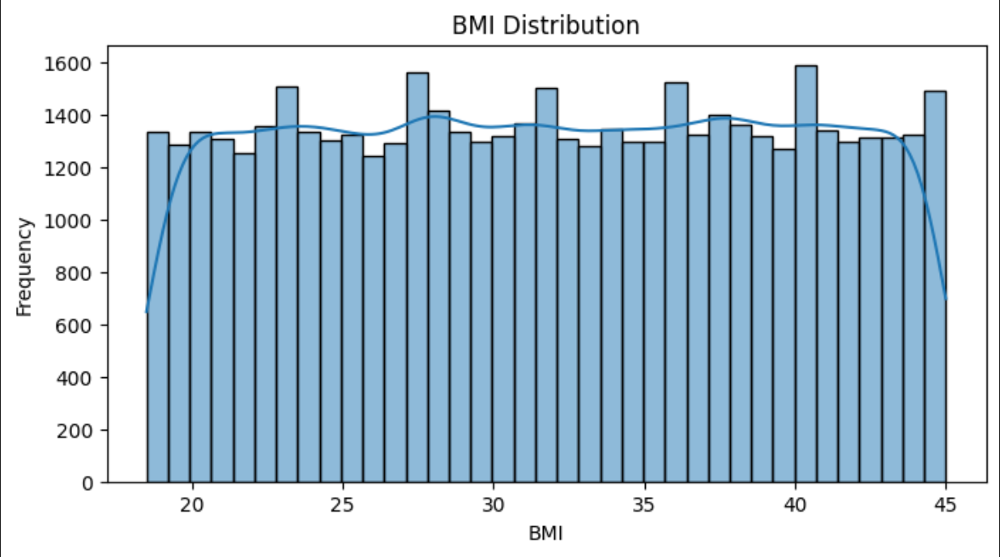
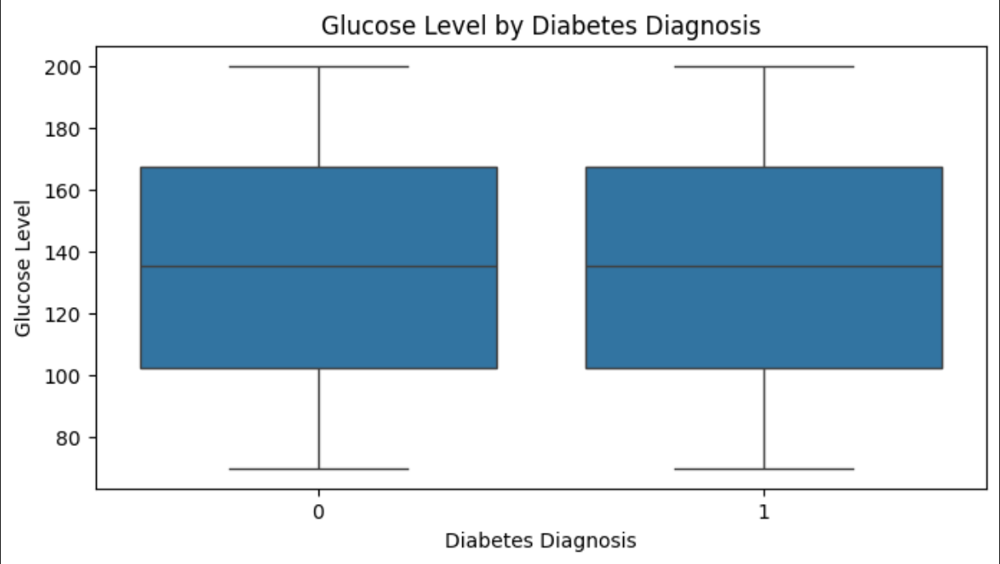
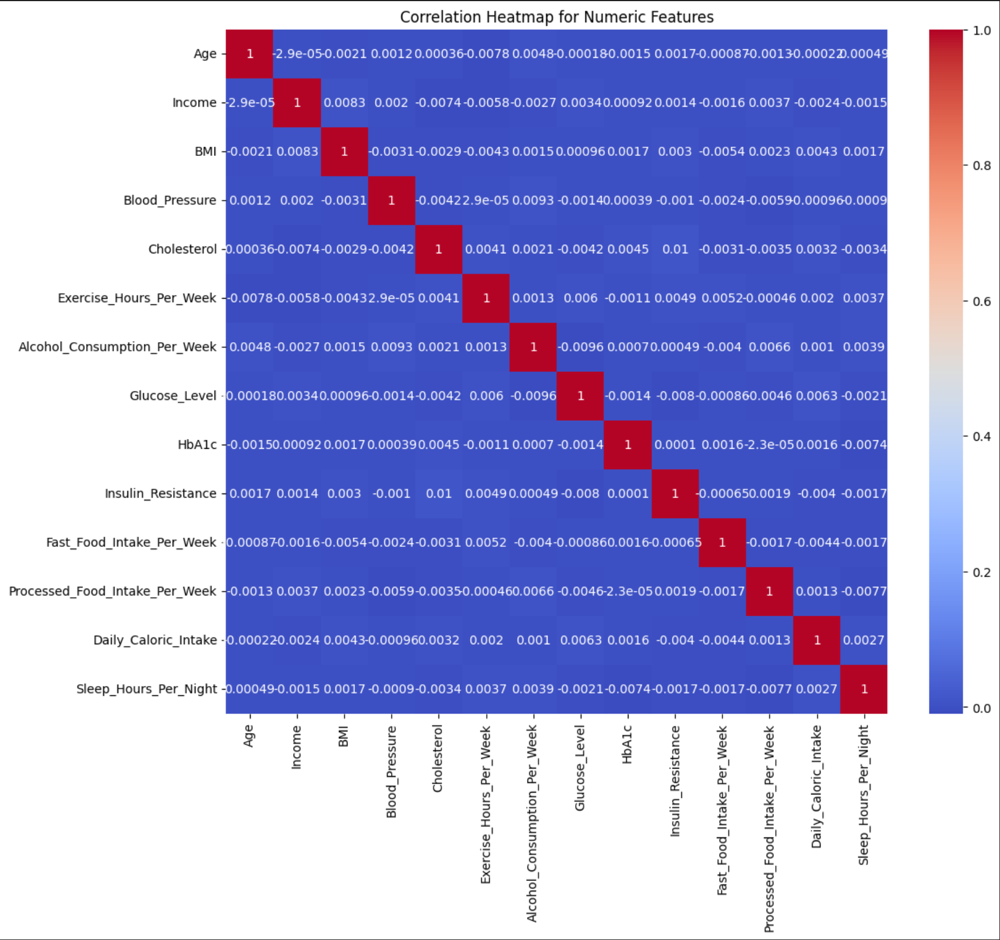
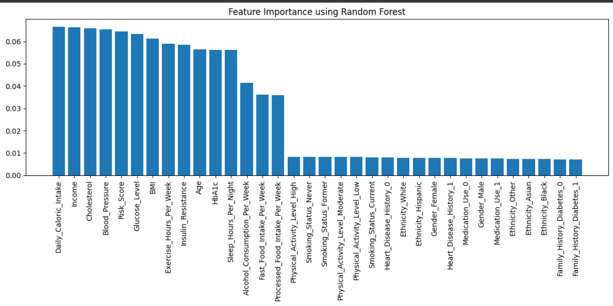

## Diabetes Risk Prediction and Health Analytics

### Summary

This project aims to build a predictive system for diabetes risk using traditional and deep learning models. We use structured patient data to train and evaluate models such as Logistic Regression and Random Forests, and plan to use Feed-Forward Neural Networks (FNNs). We assess their performance based on accuracy and interpretability to determine the most effective and trustworthy approach. The work here establishes a baseline for transparent and clinically useful machine learning in diabetes diagnostics.

### Dataset

We use the [Diabetes Prediction in America Dataset](https://www.kaggle.com/datasets/ashaychoudhary/diabetes-prediction-in-america-dataset), a synthetically generated patient record dataset (HIPAA-compliant).  

### Data Preprocessing

We identify target and features, and then proceed to define each column as either numerical or categorical. We then split the data, transforming numerical data using StandardScaler and categorical data using OneHotEncoder. 

### Data Modeling

After preprocessing, we train a RandomForestClassifier, upon which we train and evaluate a classification report which contains precision, recall, F1-score, and accuracy metrics. Additionally, a confusion matrix and ROC AUC score is produced. Additionally we train another RandomForestClassifier using hyperparameter tuning. We use XGBoost and GridSearch with 5-fold cross-validation (cv=5) to avoid overfitting. This model tests different combinations of models and parameters and selects the "best" model based on validation score. 

### Preliminary Results

| Model                                         | Accuracy | ROC-AUC |
|-----------------------------------------------|----------|---------|
| Random Forest                                 | 0.50     | 0.5019  |
| Random Forest using hyperparameter tuning     | 0.50     | 0.4961  |

ROC-AUC scores are currently low, suggesting further tuning or feature engineering is necessary. 

### Visualization

Shows how BMI values are distributed

Shows glucose levels for diabetic vs. non-diabetic patients

Shows how strongly numerical features are related

Feature Importance tells us how much each feature was used for the decision making of the random forest classifier. The higher the importance, the more the feature will make splits in decision trees. An analysis of feature importance may help us train a model with higher accuracy. 

