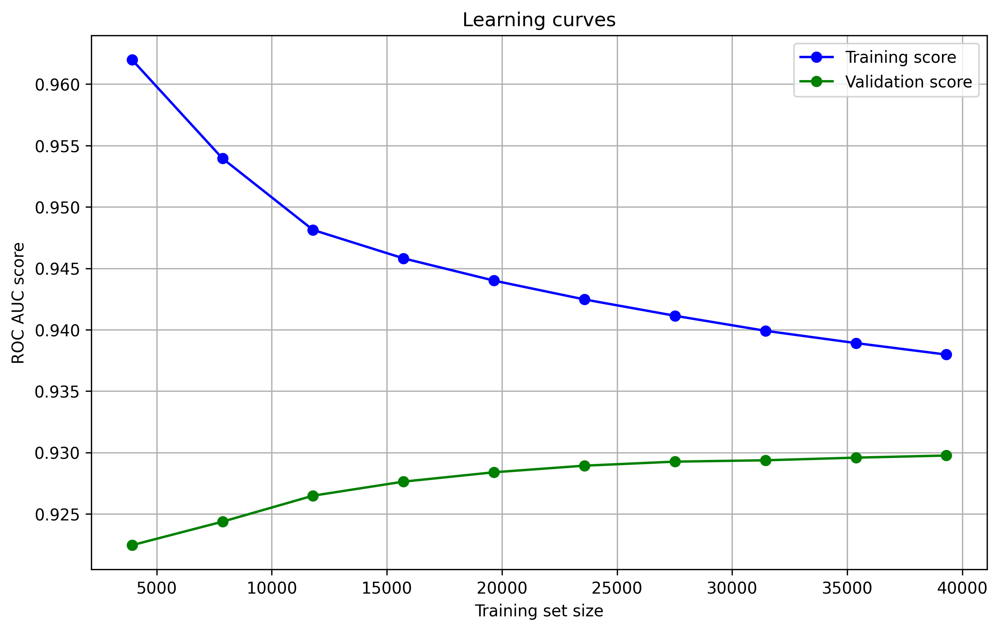

# DiaPredict: Predicting Diabetes Risk from Health Indicators (Final Report)

## Project Summary
DiaPredict is a machine learning project developed as part of a Data Science Tools and Applications course. The objective is to predict the likelihood of diabetes in individuals based on a set of health indicators from survey data. The project covers the full data science lifecycle including data collection, preprocessing, visualization, feature engineering, feature extraction, and model training/evaluation.

## Dataset Overview
We initially worked with an older dataset for the midterm phase of the project. For the final report, we switched to a newer and more comprehensive dataset: `diabetes_binary_health_indicators_BRFSS2015.csv`. This dataset was sourced from the [Diabetes Health Indicators Dataset on Kaggle](https://www.kaggle.com/datasets/alexteboul/diabetes-health-indicators-dataset) and includes numerous binary and numerical health indicators for diabetes prediction.

The change was motivated by the availability of more balanced and richer features in the updated dataset, improving the reliability of our models.

## Project Goals
- Build a predictive model to estimate the risk of diabetes based on health-related survey data.
- Explore which health indicators are most predictive of diabetes.
- Practice end-to-end data science workflows and tools in a reproducible environment.

## Data Collection
The dataset is publicly available and was obtained in CSV format. It includes over 250,000 records and dozens of features related to demographics, physical activity, BMI, smoking, alcohol consumption, and more.

## Data Cleaning and Preprocessing
- Handled missing values and type conversions.
- Investigated multicollinearity using Variance Inflation Factor (VIF).
- Performed statistical feature selection and dimensionality reduction techniques.

## Exploratory Data Analysis (EDA)
We performed a detailed exploratory data analysis to understand distributions, correlations, and feature importance:

- **Pandas Profiling** provided a quick summary of data statistics.
- **Correlation matrix** and pairwise plots highlighted feature relationships.

Key Visualizations:
- 
- 
- 
- 

## Feature Engineering and Extraction
We applied several techniques to extract and prioritize the most informative features:
- **SelectKBest** using `chi2` and `f_classif` scoring functions
- **PCA** (Principal Component Analysis) for dimensionality reduction and exploratory projection
- **SHAP** values for interpretability, particularly on tree-based models like XGBoost

## Modeling
We trained and evaluated several classification models:
- Logistic Regression
- Random Forest Classifier (with hyperparameter tuning via GridSearchCV)
- XGBoost Classifier

Evaluation metrics:
- Accuracy
- Confusion Matrix
- Classification Report (Precision, Recall, F1-score)
- ROC Curve and AUC

## Results Summary
Random Forest performed best in terms of accuracy and generalization. Feature importance plots indicated that physical health, general health, and mental health were the most predictive variables, followed by income, BMI, and difficulty walking.

## How to Reproduce
> [WIP]: Makefile to install dependencies according to a requirements.txt (need info on python/dependency versions)
> Testing:
    Run pip install pytest in project directory
    Run python -m pytest -q

## Future Work and Limitations
- Improve hyperparameter tuning and cross-validation
- Implement more interactive visualizations using Plotly or Dash
- Further balance the dataset or experiment with resampling methods like SMOTE

## Video Presentation
*Link to YouTube presentation will be added here once available.*
