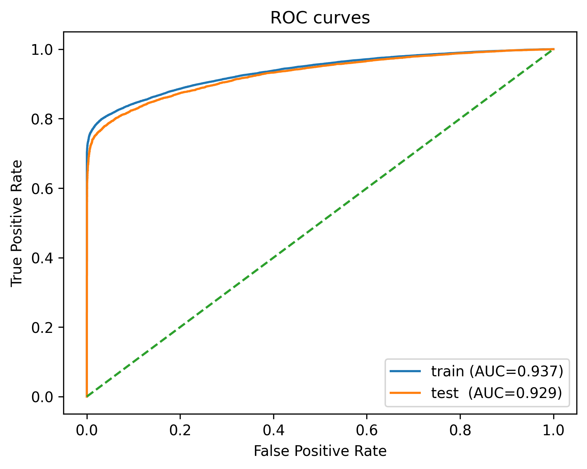

# DiaPredict: Predicting Diabetes Risk from Health Indicators (Final Report)

## Project Summary
DiaPredict is a machine learning project developed as part of a Data Science Tools and Applications course. The objective is to predict the likelihood of diabetes in individuals based on a set of health indicators from survey data. The project covers the full data science lifecycle including data collection, preprocessing, visualization, feature engineering, feature extraction, and model training/evaluation.

## How to Build & Run

1. **Create a virtual environment** (MacOS)
```bash
python3 -m venv .venv
source .venv/bin/activate
```

2. **Install dependences**
```bash
pip install --upgrade pip
pip install -r requirements.txt
```

3. **Open and run the notebook:**
Launch Jupyter and execute all cells in ```diapredict_new.ipynb```

  This will:
  - Load, clean, and preprocess our dataset
  - Perform feature engineering
  - Train & evaluate various models: Logistic Regression, RandomForest, and XGBoost models

## Testing
To verify core functionality:
```bash
pip install pytest
python -m pytest -q
```

## Dataset Overview
We initially worked with an older dataset for the midterm phase of the project. For the final report, we switched to a newer and more comprehensive dataset: `diabetes_binary_health_indicators_BRFSS2015.csv`. This dataset was sourced from the [Diabetes Health Indicators Dataset on Kaggle](https://www.kaggle.com/datasets/alexteboul/diabetes-health-indicators-dataset) and includes numerous binary and numerical health indicators for diabetes prediction.


## Project Goals
- Build a predictive model to estimate the risk of diabetes based on health-related survey data.
- Explore which health indicators are most predictive of diabetes.
- Practice end-to-end data science workflows and tools in a reproducible environment.

## Data Collection
The dataset is publicly available and was obtained in CSV format. It includes over 250,000 records and dozens of features related to demographics, physical activity, BMI, smoking, alcohol consumption, and more.

## Data Cleaning and Preprocessing
- Handled missing values and type conversions.
- Investigated multicollinearity using Variance Inflation Factor (VIF).
- Performed statistical feature selection and dimensionality reduction techniques.
- Handled missing values, duplicate data, and one-hot encoded categorical data

## Exploratory Data Analysis (EDA)
We performed a detailed exploratory data analysis to understand distributions, correlations, and feature importance:

- **Pandas Profiling** provided a quick summary of data statistics.
- **Correlation matrix** and pairwise plots highlighted feature relationships.

>After poor results in our midterm we conducted some more exploratory data analysis on the old dataset and realized there were no real correlations meaning models failed to learn. This is shown below.


However, with our new dataset we were able to find better correlations and distributions in our data.
 


## Feature Engineering and Extraction
We applied several techniques to extract and prioritize the most informative features:
- **SelectKBest** using `chi2` and `f_classif` scoring functions. This was crucial in choosing which components would help our models perform the best
- **PCA** (Principal Component Analysis) for dimensionality reduction and exploratory projection.
- **SHAP** values for interpretability, particularly on tree-based models like XGBoost

## Modeling
We trained and evaluated several classification models:
- Logistic Regression
- Random Forest Classifier (with hyperparameter tuning via GridSearchCV)
- XGBoost Classifier

Evaluation metrics:
- Accuracy
- Confusion Matrix
- Classification Report (Precision, Recall, F1-score)
- ROC Curve and AUC

## Results Summary
Random Forest performed best in terms of accuracy and generalization (AUC score of 0.929 vs XGBoost, 0.90). Feature importance plots indicated that physical health, general health, and mental health were the most predictive variables, followed by income, BMI, and difficulty walking.

Key Visualizations:
- RF Feature Importances: These show us which features we chose had the largest impact on the RF model performance

- Learning curve: this shows that our training and vaidation data are both converging so the model learns well and is generalizing well

- The ROC curve also shows that our model performs well with a good true positive rate 

## Future Work and Limitations
- Improve hyperparameter tuning and cross-validation
- Implement more interactive visualizations using Plotly or Dash
- Further balance the dataset or experiment with resampling methods like SMOTE

## Video Presentation
[*Video Presentation*](https://youtu.be/ClQDCfXOUcg)
